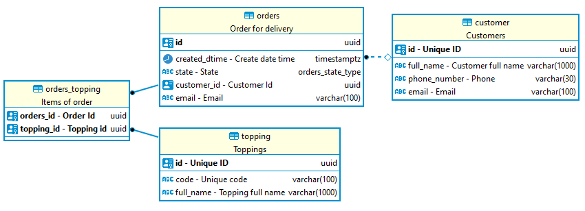
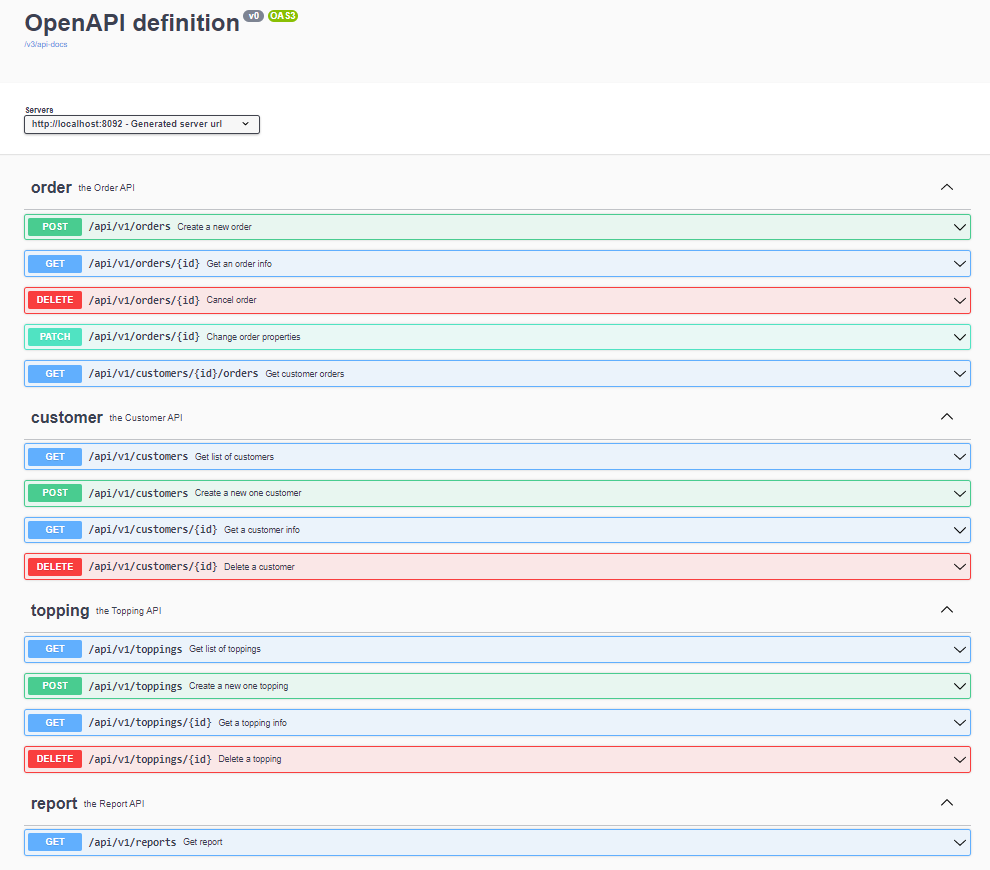
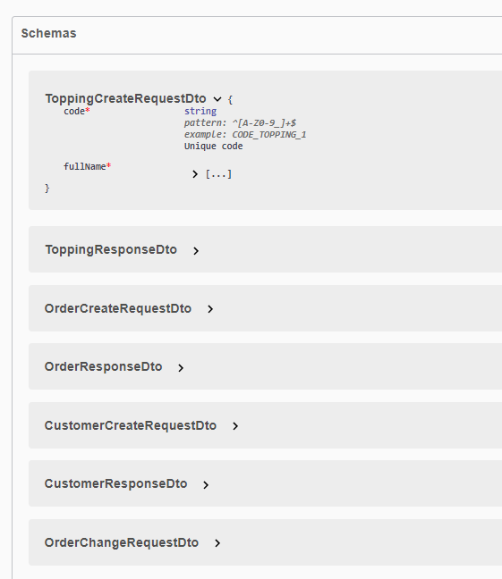

# Pizzeria application
This is a test task for Coherentsolutions.com (Spring &amp; Kotlin)

Description
Problem: The business has decided that it wants to expand into other industries and to open a pizzeria. After collaborating with multiple food supplier services in the area, we realized that we need to figure out which toppings customers would want so that we know what to order.

<details>
  <summary>Task details</summary>
Requirements:

1. Create an endpoint that allows for customers to submit their email address along with the list of toppings that they would be interested in.
2. Create an endpoint that allows for the front end team to grab the list of toppings currently submitted and the number of unique customers that have requested that topping.
3. Only the customer’s latest topping submission will be recorded.
4. Implementation must happen using Kotlin & Spring Boot.

Bonus points will be awarded for:
- Persisting data between runs
- Creativity for adding additional features
- A special endpoint for listing your personal topping choice!

</details>

## Task solution

This is a standard RestApi application based on the Spring framework that uses an RDBMS and Swagger documentation.

Technical stack: Kotlin, Spring Boot 3 (MVC, Data JPA, Validation, etc.), PostgreSQL 14, JUnit 5, Testcontainers, Docker-Compose.


### Database ER-diagram

Key entities: Customer, Topping, Order.
Postgresql enum type was used for a field type (order_state).



### RestApi documentation

Swagger documentation is available here: http://address:port/swagger-ui/index.html




### Usage of application

It’s really handy to use docker-compose to build the application with the database and pgAdmin.  
_Note: You need JRE 17 for buildJar._

```bash
git clone git@github.com:kivilev/pizzeria-app.git
cd pizzeria-app

For Windows:
gradlew clean bootJar
For *nix:
./gradlew clean bootJar
```

Build the application with the docker-compose command.

```bash
docker-compose build
```

Run the application with the docker-compose command.

```bash
docker-compose up
```

Now you can:

1. Send some requests to `http://localhost:8092`.
2. Open Swagger-UI `http://localhost:8092/swagger-ui/index.html`
3. Get access to PgAdmin `http://localhost:8090/`
   (email: root@root.com, password: root)

Stop the application with the docker-compose command.

```bash
docker-compose down
```

### Using API to achieve goals

Action

- creating a new one customer;
  ```http request
  POST http://localhost:8092/api/v1/customers
   ```
- creating a new one topping;
  ```http request
  POST http://localhost:8092/api/v1/toppings
   ```
- creating a new order for customer with toppings;
  ```http request
  POST http://localhost:8092/api/v1/orders
   ```
- get customer's orders by states;
  ```http request
  GET http://localhost:8092/api/v1/customers/{customerId}/orders?state=CREATED&state=DELIVERED
  ```
- getting toppings unique customers report;
  ```http request
  GET http://localhost:8092/api/v1/reports?type=TOPPINGS_UNIQUE_CUSTOMERS_REPORT
  ```

More details here: `http://localhost:8092/swagger-ui/index.html`

### Possible Improvements

Definitely, the application is not production-ready. It’s just a simple code demo.
Some improvements that can be done:

- Build more module tests because right now the application is covered by at most 20%;
- Split module tests into two different Gradle tasks: unit-tests and component-tests;
- Deploy it to a server for testing and production environments from CI/CD;
- Use .env and GitHub/GitLab secrets.
- etc.

## About author

Hi 👋, My name's Denis Kivilev</h1>

I'm a **Java/Oracle developer with over 17+ years** of experience working in the fintech, retail, banking, and education
sectors.

I have expertise in: Java 8+, Kotlin 1.6+, Spring, Spring Boot 2-3, Oracle 9+, PL/SQL, SQL, optimization, PostgreSQL
10+, Kafka, Redis, Junit4/5, Mockito, Groovy, Kibana, Grafana, Docker, Kubernetes, Maven, Gradle, TeamCity, Nexus, Git,
Github, GitLab, Jira, Confluence.

I am also involved in educational activities and developing an Oracle DBMS community in CIS region. I am the creator and
author of several YouTube/Telegram channels (with thousands of subscribers). I create training programs (PL/SQL,
partitioning, optimization) and provide training. Many people have improved their qualifications with my help.

📫 **How to reach me:**

- telegram: [@kivilev](https://t.me/kivilev)
- email: kivilev.d@gmail.com
- whatsapp: +995 591 01 77 58
- linkedin: https://www.linkedin.com/in/kivilev/
